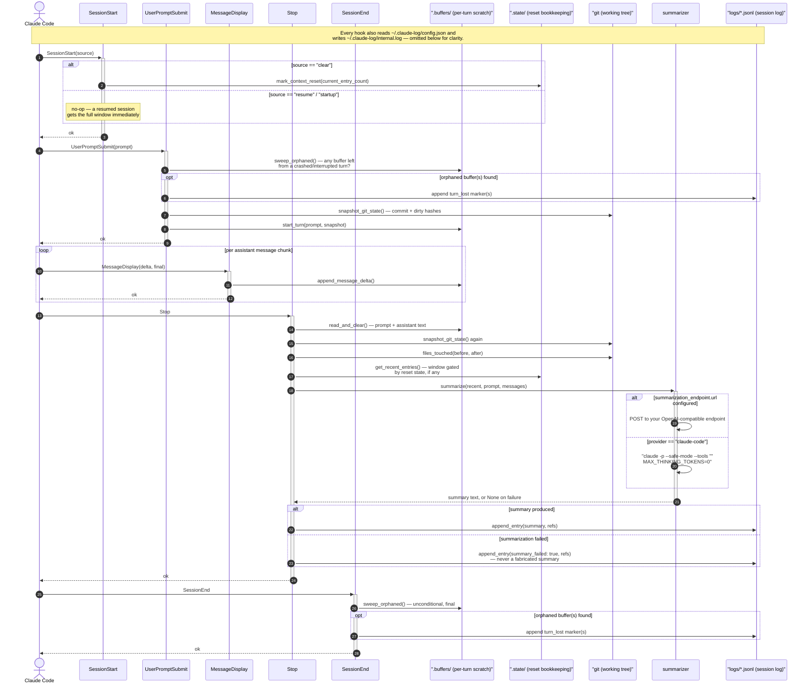

```mermaid
sequenceDiagram
    autonumber
    actor CC as Claude Code
    participant SS as SessionStart
    participant UPS as UserPromptSubmit
    participant MD as MessageDisplay
    participant STOP as Stop
    participant SE as SessionEnd
    participant BUF as ".buffers/ (per-turn scratch)"
    participant STATE as ".state/ (reset bookkeeping)"
    participant GIT as "git (working tree)"
    participant SUM as summarizer
    participant LOG as "logs/*.jsonl (session log)"

    Note over CC,LOG: Every hook also reads ~/.claude-log/config.json and<br/>writes ~/.claude-log/internal.log — omitted below for clarity.

    CC->>+SS: SessionStart(source)
    alt source == "clear"
        SS->>STATE: mark_context_reset(current_entry_count)
    else source == "resume" / "startup"
        Note over SS: no-op — a resumed session<br/>gets the full window immediately
    end
    SS-->>-CC: ok

    CC->>+UPS: UserPromptSubmit(prompt)
    UPS->>BUF: sweep_orphaned() — any buffer left<br/>from a crashed/interrupted turn?
    opt orphaned buffer(s) found
        UPS->>LOG: append turn_lost marker(s)
    end
    UPS->>GIT: snapshot_git_state() — commit + dirty hashes
    UPS->>BUF: start_turn(prompt, snapshot)
    UPS-->>-CC: ok

    loop per assistant message chunk
        CC->>+MD: MessageDisplay(delta, final)
        MD->>BUF: append_message_delta()
        MD-->>-CC: ok
    end

    CC->>+STOP: Stop
    STOP->>BUF: read_and_clear() — prompt + assistant text
    STOP->>GIT: snapshot_git_state() again
    STOP->>GIT: files_touched(before, after)
    STOP->>STATE: get_recent_entries() — window gated<br/>by reset state, if any
    STOP->>+SUM: summarize(recent, prompt, messages)
    alt summarization_endpoint.url configured
        SUM->>SUM: POST to your OpenAI-compatible endpoint
    else provider == "claude-code"
        SUM->>SUM: "claude -p --safe-mode --tools #34;#34;<br/>MAX_THINKING_TOKENS=0"
    end
    SUM-->>-STOP: summary text, or None on failure
    alt summary produced
        STOP->>LOG: append_entry(summary, refs)
    else summarization failed
        STOP->>LOG: append_entry(summary_failed: true, refs)<br/>— never a fabricated summary
    end
    STOP-->>-CC: ok

    CC->>+SE: SessionEnd
    SE->>BUF: sweep_orphaned() — unconditional, final
    opt orphaned buffer(s) found
        SE->>LOG: append turn_lost marker(s)
    end
    SE-->>-CC: ok
```
